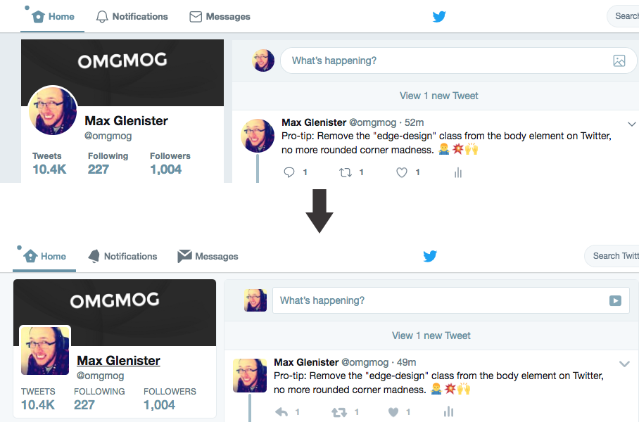

## What is this?

A chrome extension that simply removes the `.edge-design` class from the `body` element on Twitter. 

That class applies the _new_ rounded design to everything.

## Installation

1. Download the code
2. Navigate chrome to `chrome://extensions`
3. Check the "Developer mode" toggle
4. Click on "Load Unpacked Extension..."
5. Select the folder containing the code
